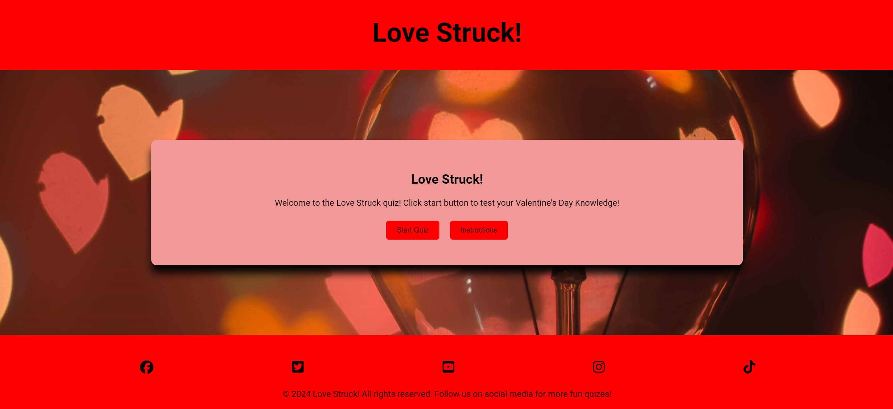
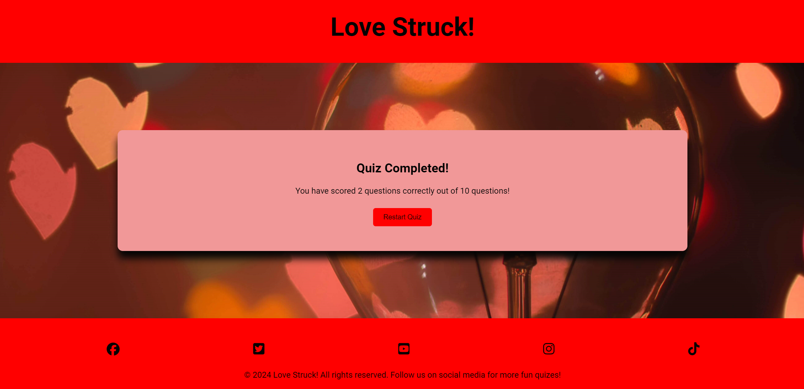

# Love Struck!

Love Struck! is a multiple-choice Valentine's Day quiz for adults or families to play around Saint Valentine's Day. This quiz offers the player 10 different questions each time they play. The aim is to answer as many questions correctly as possible.

Love Struck! is designed to be a lighthearted game to test your knowledge of Valentine's Day/love-themed trivia and it is also a good way to learn new fun facts about the subject area.

[Love Struck!](https://mcallisterliza.github.io/love-struck/) can be played by clicking the link.

## **User Stories**

### First Time Visitor Goals:

* As a newcomer to the site, my objective is to find out the main purpose of the game.
* As a first-time visitor, I aim to navigate the game effortlessly, play the game and find out what my score is at the end.
* As a first-time visitor, I want to have some fun and play the game to test my Valentine's Day knowledge.

### Returning Visitor Goals:
* As someone revisiting the site, I want to play the game again with some different questions.
* As a returning visitor, I want to see if I can improve my score.

### Frequent Visitor Goals:
* As a returning visitor, I want to find social media links, so I can visit the quiz company's social media pages to play more quizzes.

## Features

### Home Page

The home page has a red header and footer and the main background has an image depicting hearts. Within the header is the H1 logo with 'Love Struck!' When the user clicks the h1 logo at any point in the game they are directed back to the home page. On the homepage are also two buttons:

- Start Quiz
- Instructions

### Footer

The footer is visible throughout the game and has four font awesome icons within it. Each icon directs the user to the pictured social media site. When hovered over the icons turn to pale pink (as pictured below) to match the color scheme.

### Instructions

If the user clicks the "Instructions" button they are directed to a new screen where the instructions are listed for them to read. This page has a 'back to start' button which when clicked the user is directed back to the home page.

### Quiz Screen

- Once the player clicks the start button on the home page the first question with four possible answers is displayed.
- Once the player clicks an answer the next question is displayed automatically.
- There is a tally below the questions and answers which shows the player what they have currently scored correctly out of the questions they have answered.
- There are different questions displayed each time the player restarts the game.

### Quiz Completed!

- Once the player has answered 10 questions the final screen will be displayed.
- This screen shows the player their score and a 'restart quiz' button which when pressed directs the player back to the home page to start over if they wish.

### Future ideas for the Love Struck! quiz game

- If I had more time I would have enjoyed implementing the following:
- A timer that gives the player only a certain number of seconds per question to add to the fun of the game.
- I would have liked to have added something to the quiz that rewarded players who answered all questions correctly.
- A leaderboard would have been good to implement to entice the player back to the game to increase their score publically.

